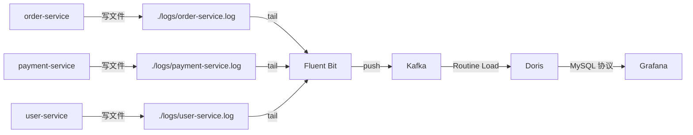

# 日志处理平台

技术栈：Spring Boot + Fluent Bit + Kafka + Doris + Grafana

## 快速开始

前置条件：Java 17、Maven、Docker

```shell
# 启动基础设施
docker compose up -d

# 初始化数据库
docker exec -i log-platform-fe-1 mysql -P 9030 -h 127.0.0.1 -u root < init-doris.sql

# 编译并启动服务
mvn clean package -DskipTests
java -jar order-service/target/order-service-1.0-SNAPSHOT.jar &
java -jar payment-service/target/payment-service-1.0-SNAPSHOT.jar &
java -jar user-service/target/user-service-1.0-SNAPSHOT.jar &

# 打开 Grafana
open http://localhost:3000
```

模拟流量

```shell
c1=$(( 0 + RANDOM % 20 ))
c2=$(( 10 + RANDOM % 20 ))
c3=$(( 20 + RANDOM % 20 ))
for j in $(seq 1 $c1); do curl -s -X POST http://localhost:8081/order > /dev/null; done
for j in $(seq 1 $c2); do curl -s -X POST http://localhost:8082/pay > /dev/null; done
for j in $(seq 1 $c3); do curl -s -X POST http://localhost:8083/login > /dev/null; done
echo "order=$c1, pay=$c2, login=$c3"
```

关闭

```shell
# 停止 Spring Boot 服务
pkill -f "order-service\|payment-service\|user-service"

# 停止 Docker 容器
docker compose down
```

## 架构



## 技术选型

可观测性日志处理领域，经典链路是日志的采集、存储、可视化，中间加一层消息队列做缓冲。

采集层：Fluent Bit。CNCF 毕业项目，生态丰富，内存占用小。

缓冲层：Kafka。用的人多，自己也比较熟悉，缺点是并非云原生架构。

存储层：

- Elasticsearch 优势在于全文索引，日志场景用不到。
- ClickHouse 把存算分离架构的核心特性闭源。
- 最终选择了 Doris，开源、云原生。

展示层：Grafana 是毋庸置疑的选择。

日志格式：通过 LogstashEncoder 将输出格式化位 JSON。

## 参考文档

Doris 部署

https://doris.apache.org/docs/4.x/getting-started/quick-start#step-1-13-download-the-startup-script

Grafana 配置自动加载

https://grafana.com/docs/grafana/latest/administration/provisioning/

Fluent Bit

https://docs.fluentbit.io/manual/data-pipeline/inputs/tail

https://docs.fluentbit.io/manual/data-pipeline/outputs/kafka

## 未来优化

- 很多组件，某一层出现问题，该如何排查？
- K8s 中日志采集应当使用 DaemonSet。

## 反思

回过头看，用了大概四天时间，三天时间在进行调研与知识梳理：大数据架构是什么样的？发展脉络是什么？系统应该使用什么架构？什么技术栈？随后进行需求分析，从对应技术官方文档学习如何使用。写代码反而是最轻松的？

## 遇到的 Bug

Grafana 导出配置后，在新环境下自动导入配置的问题。可视化界面连接数据源，数据源的 uid 是随机的，仪表盘 json 文件中绑定随机 uid。但是自动导入配置中，需要指定 uid，因此还得把随机 uid 统一替换为固定 uid。
